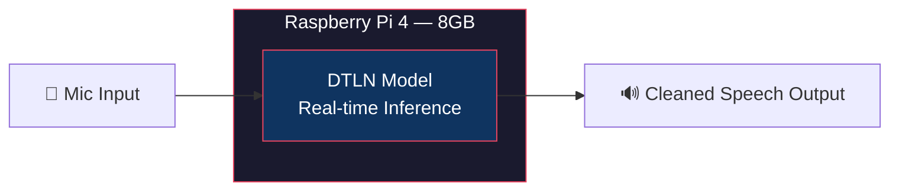

<div align="center">

# 🎙️ AI/ML Adaptive Noise Cancellation for Defense Comms

### Smart India Hackathon 2026 · Problem Statement SIH26052 · DRDO

*Real-time, edge-deployable speech enhancement for stationary, non-stationary, and impulsive battlefield noise*


-c51a4a)


</div>

---

## 📋 Problem Statement

Defense communication systems face severe intelligibility loss from **gunfire, artillery, rotor noise, and vehicle engines** — noise that is loud, sudden, and unpredictable. Classical adaptive filters (LMS/NLMS) are built for steady background hum and struggle badly with these fast, impulsive events.

This project fine-tunes a pretrained deep learning model to suppress both realistic ambient noise and synthesized impulsive defense noise, deployed live on cheap edge hardware — no cloud, no internet dependency.

## 🏗️ Architecture



**Pipeline flow:** LibriSpeech clean speech + synthesized defense noise (gunshot/rotor/artillery/vehicle) + real recorded ambient noise → mix at randomized SNR → fine-tune pretrained DTLN (CPU, laptop) → export to two-stage TFLite → validate on held-out test set → deploy for live inference on Pi 4.

## ✨ Key Features

| | |
|---|---|
| 🎯 **Impulsive-noise aware** | Fine-tuned specifically on synthesized gunshot/artillery/rotor/vehicle noise — the exact gap in classical LMS-based ANC |
| ⚡ **Real-time, causal, low-latency** | Streams frame-by-frame, ~24ms inherent algorithmic delay (well under real-time speech thresholds) |
| 🔌 **Fully edge-deployed, low-cost** | Runs entirely on-device on a Raspberry Pi 4 (8GB) — no Jetson, no cloud dependency |
| 📊 **Honestly benchmarked** | Real measured SNR / STOI / PESQ on held-out test data, both before and after fine-tuning |
| 🔁 **Validated at every stage** | Pretrained baseline → fine-tuned `.h5` → converted `.tflite`, each independently measured to confirm no quality loss along the way |

## 🛠️ Tech Stack

- **Model**: [DTLN](https://github.com/breizhn/DTLN) (Dual-signal Transformation LSTM Network), pretrained on DNS-Challenge (500h), fine-tuned on defense noise
- **Training**: Python, TensorFlow 2.21 / Keras 3, CPU fine-tuning (laptop)
- **Deployment**: Two-stage TFLite export, Raspberry Pi 4 (8GB), using [PiDTLN](https://github.com/SaneBow/PiDTLN) real-time runtime
- **Datasets**: LibriSpeech `dev-clean` (real recorded speech) + synthesized defense noise (gunshot/rotor/artillery/vehicle engine, physically-modeled) + real recorded ambient noise
- **Evaluation**: SNR, STOI, PESQ (wideband), cross-correlation-aligned to correct for block-processing latency

## 📁 Repository Structure

```
sih26052-anc-defense/
├── data/
│   ├── LibriSpeech/dev-clean/        # clean speech source
│   └── defense_noise/                # synthesized gunshot/rotor/artillery/vehicle clips
├── generate_defense_noise.py         # synthesizes physically-modeled defense noise
├── mix_data.py                       # generates noisy/clean training pairs at randomized SNR
├── build_defense_testset.py          # builds held-out test set for evaluation
├── run_training.py                   # fine-tunes pretrained DTLN (loads pretrained weights first)
├── convert_weights_to_tf_lite.py     # exports fine-tuned .h5 to two-stage .tflite
├── test_tflite_batch.py              # batch-runs .tflite model for validation
├── evaluate_batch.py                 # computes SNR/STOI/PESQ against PS targets
├── evaluate_aligned.py               # same, with cross-correlation delay correction
├── pretrained_model/                 # original DTLN pretrained weights (.h5, .tflite)
├── models_dtln_defense_finetune/     # our fine-tuned weights (.weights.h5)
├── finetuned_tflite_models/          # our fine-tuned model_1.tflite + model_2.tflite (Pi-ready)
└── README.md
```

## 🚀 Setup

```bash
# Clone the base DTLN repo
git clone https://github.com/breizhn/DTLN.git
cd DTLN

# Set up environment
python3 -m venv venv
source venv/bin/activate        # Windows: venv\Scripts\activate
pip install tensorflow soundfile numpy scipy librosa wavinfo pystoi pesq sounddevice

# Get clean speech data
curl -o data/dev-clean.tar.gz https://www.openslr.org/resources/12/dev-clean.tar.gz
tar -xzf data/dev-clean.tar.gz -C data

# Generate synthetic defense noise + build training pairs
python generate_defense_noise.py --out_dir ./data/defense_noise --n_per_class 200
python mix_data.py --clean_dir ./data/LibriSpeech/dev-clean --noise_dir ./data/defense_noise --out_dir ./data/train_pairs --n_samples 2000

# Fine-tune (edit paths in run_training.py first)
python run_training.py

# Convert to TFLite for Pi deployment
python convert_weights_to_tf_lite.py -m ./models_dtln_defense_finetune/dtln_defense_finetune.weights.h5 -t ./finetuned_tflite_models

# Deploy on Raspberry Pi 4 (via PiDTLN)
git clone https://github.com/SaneBow/PiDTLN.git
# copy finetuned_tflite_models/*.tflite into PiDTLN/models/, then:
python3 ns.py -i <mic_device> -o <output_device>
```

## 📊 Results

Measured on 30 held-out test samples (defense noise, 5dB input SNR), cross-correlation-aligned to correct for ~24ms block-processing delay:

| Metric | Unprocessed (noisy) | Pretrained DTLN | Fine-tuned DTLN (.h5) | Fine-tuned DTLN (.tflite, Pi-ready) | Target (PS) |
|---|---|---|---|---|---|
| SNR (dB) | 5.71 | 17.21 | **18.70** | 18.56 | > 15 dB ✅ |
| STOI | 0.875 | 0.954 | **0.960** | 0.959 | > 0.85 ✅ |
| PESQ | 1.47 | 2.46 | **2.68** | 2.55 | > 2.5 ✅ |

All three PS targets are met by the fine-tuned model, both before and after TFLite conversion for edge deployment. The small drop from `.h5` to `.tflite` (≤0.14dB SNR, ≤0.13 PESQ) is expected float32 conversion variance, not a quality regression.

**Caveats, stated honestly:**
- Defense noise (gunshot/rotor/artillery/vehicle) is synthetically generated, not field-recorded — a deliberate, time-constrained engineering choice
- Tested at a single input SNR (5dB) so far; testing across a range (0–15dB) is planned before demo day
- No classical DSP baseline (FDAF/Wiener) has been implemented yet for comparison

## 👥 Team & Roles

| Role | Owner | Focus |
|---|---|---|
| ML/training lead | | Fine-tuning pipeline, TFLite export |
| Data/noise synthesis lead | | Defense noise generation, dataset mixing |
| Evaluation lead | | SNR/STOI/PESQ benchmarking |
| Pi integration lead | | Real-time deployment on Raspberry Pi 4 |
| Presentation/docs lead | | Architecture docs, demo video, slides |

## 📚 References

- Westhausen & Meyer — *DTLN: Dual-Signal Transformation LSTM Network for Real-Time Noise Suppression*, Interspeech 2020
- [breizhn/DTLN](https://github.com/breizhn/DTLN) — pretrained model and training code
- [SaneBow/PiDTLN](https://github.com/SaneBow/PiDTLN) — Raspberry Pi real-time deployment reference
- LibriSpeech dev-clean dataset (OpenSLR)

## 📄 License

MIT — see [`LICENSE`](./LICENSE)

---

<div align="center">
<sub>Built for Smart India Hackathon 2026 · Team [Your Team Name]</sub>
</div>
