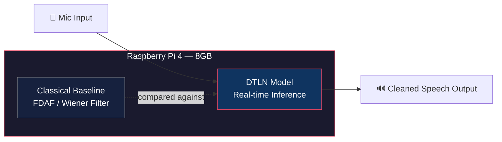

<div align="center">

# 🎙️ AI/ML Adaptive Noise Cancellation for Defense Comms

### Smart India Hackathon 2026 · Problem Statement SIH26052 · DRDO

*Real-time, edge-deployable speech enhancement for stationary, non-stationary, and impulsive battlefield noise*


</div>

---

## 📋 Problem Statement

Defense communication systems face severe intelligibility loss from **gunfire, artillery, rotor noise, and sirens** — noise that is loud, sudden, and unpredictable. Classical adaptive filters (LMS/NLMS) are built for steady background hum and struggle badly with these fast, impulsive events.

This project builds a **hybrid AI-driven ANC pipeline**: a deep learning model trained to suppress stationary, non-stationary, *and* impulsive noise simultaneously, deployed live on edge hardware — no cloud, no internet dependency, sub-second reaction to a gunshot mid-sentence.

## 🏗️ Architecture



**Pipeline flow:** synthetic noisy/clean pairs (real recorded noise + real recorded speech) → fine-tune pretrained DTLN → export to TFLite → deploy for live inference on Pi → benchmark against a classical DSP baseline.

## ✨ Key Features

| | |
|---|---|
| 🎯 **Impulsive-noise aware** | Handles gunshots/artillery, not just steady hum — the exact gap in classical LMS-based ANC |
| ⚡ **Real-time, causal** | Streams frame-by-frame live, no "look-ahead" — works for live conversation, not just recordings |
| 🔌 **Fully edge-deployed** | Runs entirely on-device (Raspberry Pi 4), no cloud dependency — critical for field use |
| 📊 **Honestly benchmarked** | Real measured SNR / PESQ / STOI, reported against published research ranges, not inflated claims |
| 🧪 **Dual validation** | AI model *and* a classical filter baseline, so improvement is provable, not asserted |

## 🛠️ Tech Stack

- **Model**: [DTLN](https://github.com/breizhn/DTLN) (Dual-signal Transformation LSTM Network), fine-tuned
- **Training**: Python, TensorFlow 2.x, Google Colab (GPU)
- **Deployment**: TFLite, Raspberry Pi 4 (8GB)
- **Datasets**: SESA, C3GD, GISE-51, VGGSound (real recorded noise) + LibriSpeech (real recorded speech) + custom-extracted clips
- **Evaluation**: SNR, PESQ, STOI
- **Classical baseline**: FDAF / Wiener filter (DSP, no ML)

## 📁 Repository Structure

```
sih26052-anc-defense/
├── data/
│   ├── download_datasets.py     # pulls SESA / C3GD / GISE-51 / VGGSound / LibriSpeech
│   ├── extract_from_video.py    # yt-dlp + Audacity-assisted event extraction
│   └── mix_pairs.py             # generates noisy/clean training pairs at randomized SNR
├── training/
│   ├── finetune_dtln.py         # fine-tunes pretrained DTLN on our mixed dataset
│   └── eval_metrics.py          # computes SNR / PESQ / STOI on held-out test set
├── inference/
│   ├── realtime_pi.py           # live mic-in → model → speaker-out on the Pi
│   └── classical_baseline.py    # FDAF / Wiener filter comparison, same Pi
├── docs/
│   ├── architecture.png
│   ├── results.md               # measured numbers, reported honestly
│   └── references.md            # cited research papers
├── requirements.txt
├── .gitignore
└── README.md
```

## 🚀 Setup

```bash
# Clone the repo
git clone https://github.com/<your-username>/sih26052-anc-defense.git
cd sih26052-anc-defense

# Set up environment
python3 -m venv venv
source venv/bin/activate        # Windows: venv\Scripts\activate
pip install -r requirements.txt

# Download datasets
python data/download_datasets.py

# Generate training pairs
python data/mix_pairs.py

# Fine-tune (run on Colab GPU, not locally)
python training/finetune_dtln.py

# Deploy on Raspberry Pi
python inference/realtime_pi.py
```

## 📊 Results

> Populated as we go — real measured numbers only, no placeholders left in for demo day.

| Metric | Baseline (unprocessed) | Classical (FDAF) | DTLN (fine-tuned) | Target (PS) |
|---|---|---|---|---|
| SNR (dB) | — | — | — | > 15 dB |
| PESQ | — | — | — | > 2.5 |
| STOI | — | — | — | > 0.85 |
| Latency (ms) | — | — | — | real-time |

## 👥 Team & Roles

| Role | Owner | Focus |
|---|---|---|
| Dataset lead | | Dataset sourcing & curation |
| Video-extraction lead | | Custom defense-noise clip extraction |
| ML/training lead | | Mixing pipeline, fine-tuning, evaluation |
| Pi integration lead | | Real-time deployment, latency tuning |
| Classical baseline lead | | FDAF/Wiener filter implementation |
| Presentation/docs lead | | Architecture docs, demo video, slides |

## 📚 References

- DRDO Defence Science Journal — *AI Driven Advances in Noise Cancellation* (2026)
- Westhausen & Meyer — *DTLN: Dual-Signal Transformation LSTM Network for Real-Time Noise Suppression*, Interspeech 2020
- SESA, C3GD, GISE-51 dataset papers (see `docs/references.md` for full citations)

## 📄 License

MIT — see [`LICENSE`](./LICENSE)

---

<div align="center">
<sub>Built for Smart India Hackathon 2026 · Team [Your Team Name]</sub>
</div>
